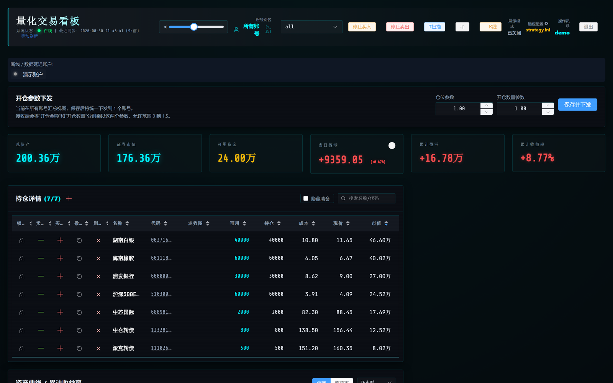
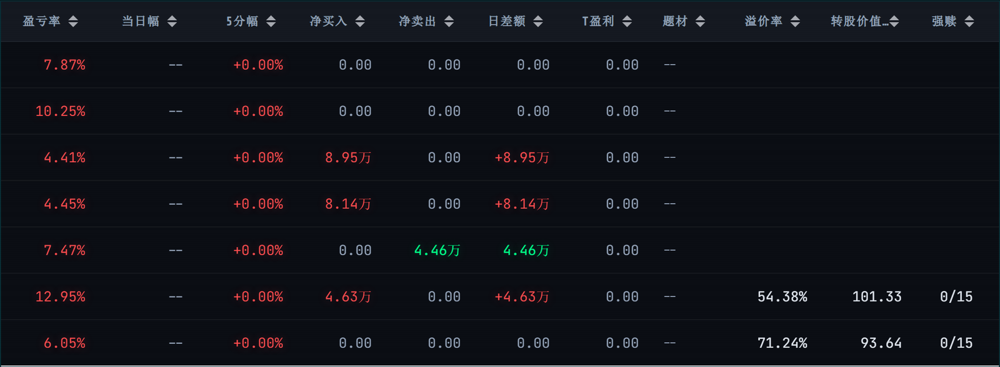
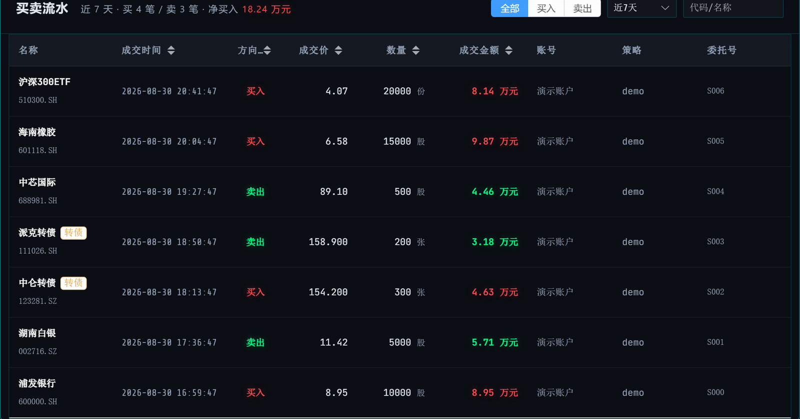
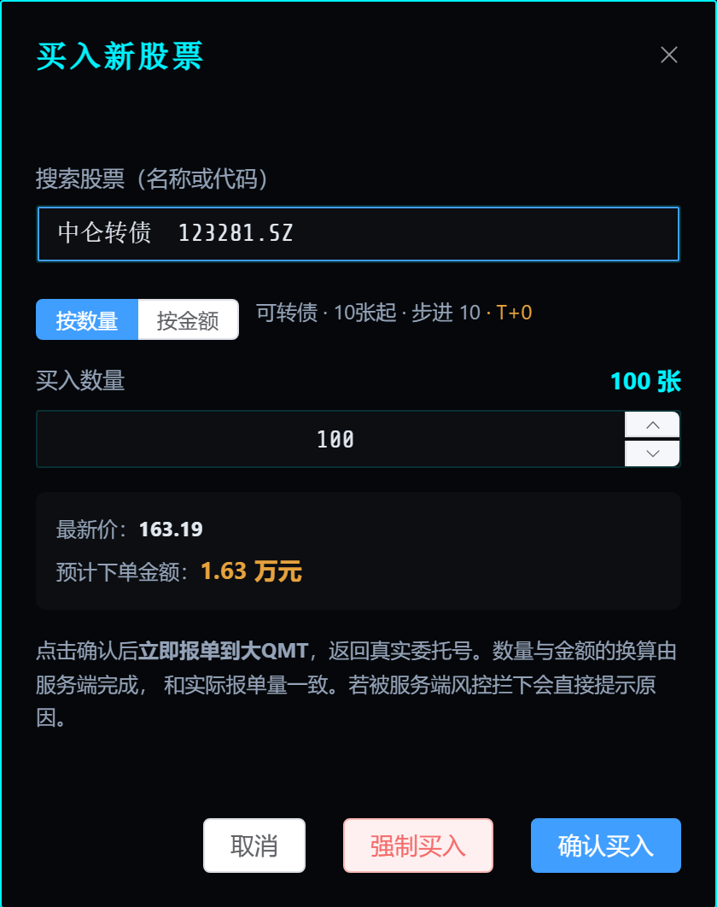
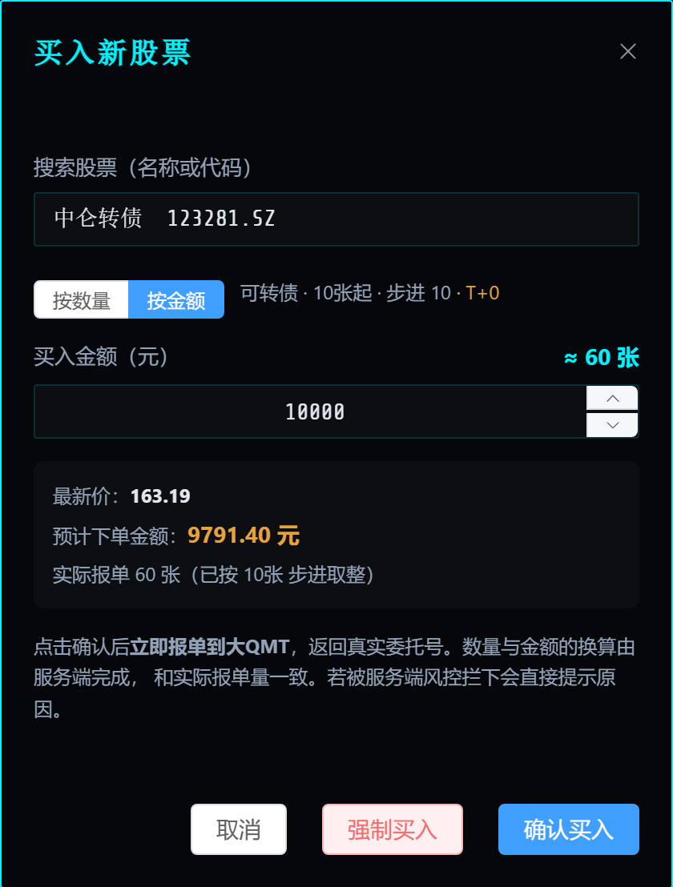

# bigqmt-dashboard

**大QMT 直连的多账号持仓监控与下单面板。** 浏览器里看持仓、资金曲线、买卖流水，点一下就把单子报进大QMT —— 没有客户端脚本、没有指令队列、没有轮询延迟。

<sub>FastAPI + Vue3 · SQLite · MIT · 交易通道走 [xtquant_big_convert](https://github.com/litaolemo/xtquant_big_convert) · [更新日志](CHANGELOG.md)</sub>

---

## 项目介绍

### 它解决什么问题

迅投 QMT 有两种用法，各有各的难处：

- **极简模式（miniQMT）**：外部 Python 用 `xtquant.xttrader` 直连，好写好接，但很多券商不开放，开放了功能也常被裁剪。
- **完整客户端（大QMT）**：功能齐全、行情和交易都在，但策略只能跑在客户端**内置的 Python 里**——外部程序够不着它。

于是常见的做法变成：在 QMT 那台机器上跑一个客户端脚本，把持仓推到服务端，再从响应里取回服务端排好的指令自己执行。这套「推送 + 指令队列」的架构有几个绕不开的毛病——点了卖出要等下一轮同步、服务端不知道单子的下场、风控只是给客户端的建议值。[下一节](#它和qmt-面板通常的做法有什么不同)有逐条对比。

[xtquant_big_convert](https://github.com/litaolemo/xtquant_big_convert) 把大QMT 内置 Python 的能力包装成 RPC，**对外暴露的是 miniQMT 的同名接口**（`xt_trader.query_stock_positions` / `order_stock` / `xtdata.get_full_tick`…）。本项目就是跑在这座桥上的面板：服务端主动查、主动报单，把交易逻辑和风控收回自己手里。

### 能做什么

| 模块 | 能力 |
|---|---|
| **持仓与资产** | 实时持仓、资金曲线、累计/当日盈亏、交易日历、盈亏矫正 |
| **下单** | 按比例卖、按数量卖、按数量买、**按金额买**（服务端用实时价换算）、一键清仓，全部当场报单并返回真实委托号 |
| **报价与价格笼子** | 21 种选价类型按交易所过滤（深市票不会出现沪市专有的市价指令）；限价单连续竞价 ±2%、集合竞价 ±10%，超出当场拒单并告知上下限 |
| **未成交与撤单** | 买卖流水上方列出报了还没成的委托（已报/部成/废单…），可直接撤单 |
| **服务端风控** | 停买/停卖/锁仓/仓位系数/展示模式，判定不过就不会有报单 —— 不是给客户端的建议值 |
| **可转债** | 10 张步进与 0.001 报价精度、溢价率/转股价值/双低、强赎进度与禁买闸门、打新债 |
| **条件单** | 止损/止盈/条件买入/涨停破板卖出/涨停买入，6 种触发类型；服务端每 5 秒查一次价，越过触发线就走正常下单链路真的报单（API 已完成，前端界面开发中，见[条件单](#条件单)） |
| **实时推送** | WebSocket 把委托状态变化、真实成交、条件单触发秒级推给浏览器，取代原来几秒一次的轮询 |
| **通知** | 成交、条件单触发/失败推送到企业微信群机器人或 Server 酱（可选） |
| **全局熔断** | 一天内买卖撤单合计超过阈值（默认 2000）自动拒绝，防的是软件自己失控 |
| **国债逆回购** | 收盘前自动把闲置现金出借（深市 131810 / 沪市 204001 挑利率高的），按账号开关，默认关闭 |
| **委托与留痕** | 活动委托视图、下单审计流水（谁、何时、下了什么、成没成、失败原因） |
| **多账号** | 每账号独立连接，可连不同机器上的大QMT；传输方式由配置决定 |
| **观察者** | 独立的只读账号体系，只看得到买卖流水，与交易账号互不相干 |
| **研究记录板** | 粘贴自然语言选股逻辑，大模型解析成结构化记录 + K线研判（可选） |

### 长什么样

先看几张图，再往下读。



持仓表里股票和转债混着，转债多出三列 —— 溢价率、转股价值、强赎进度。算不出来的显示「—」并在
tooltip 里说明原因，不会拿缺失的转股价凑一个看起来像模像样的数：



买卖流水把账户真实成交摊在一张表里——买卖同表、方向红绿、转债自动按 3 位小数和「张」显示，
可按方向和时间区间筛：



手动下单支持**按数量**和**按金额**两种方式，都实时显示预计下单金额。金额↔数量的换算在服务端完成，
因为只有服务端同时握着实时价和品种规整规则 —— 前端自己算会和实际报单量对不上：

| 按数量 | 按金额 |
|---|---|
|  |  |

上图是一只可转债：1 万元按最新价 163.19 换算成 60 张，并明说「已按 10 张步进取整」。
换成科创板会按 1 股递增（5 万元买中芯国际是 397 股，而不是整手规整后的 300 股），
资金利用率差着一截。

### 技术栈

| 层 | 用了什么 |
|---|---|
| 后端 | FastAPI + SQLite（单文件部署，无需额外数据库） |
| 前端 | Vue 3 + Element Plus + Chart.js，无构建步骤，改完刷新即可 |
| 交易与行情 | [xtquant_big_convert](https://github.com/litaolemo/xtquant_big_convert) RPC，可走 Redis / ZMQ / MySQL / 共享内存 |
| 可选数据源 | akshare（可转债参考数据）、Tushare、MySQL、OpenAI 兼容接口 —— **全部缺失也能启动** |

### 项目现状

- 只读链路（持仓/资产/委托/成交/行情/实时回报）已在实盘账号上跑通并逐字段对过账。
- 350 个测试，不需要 QMT 也不需要任何密钥就能跑；下单链路用测试替身，风控与数量规整跑的是真实代码。
- 品种规则（最小申报量、步进、报价精度）与大QMT 自己的合约数据交叉验证过。
- **条件单/通知/国债逆回购的前端界面还没做**，目前只能通过 API 直接调用；**做T执行引擎尚未包含**。详见[尚未包含](#尚未包含)。

本项目由一套更早的「推送式」面板改造而来，那套的数据入口和指令队列已整体移除。

---

## 它和「QMT 面板」通常的做法有什么不同

常见做法是在 QMT 那台机器上跑一个客户端脚本，把持仓推给服务端，顺便从响应里取回服务端排好的指令自己执行。这套东西有几个绕不开的毛病：

- **下单延迟等于客户端轮询周期**，点了「卖出」得等下一轮同步。
- **服务端不知道单子的下场**：报没报进去、被没被废单、什么原因，都发生在客户端里。
- **风控只是建议**：`停止买入` / `锁仓` / `仓位系数` 是下发给客户端的值，客户端不听服务端也没办法。
- **交易逻辑散在客户端**，版本、参数、日志都在别处。

本项目把方向掉过来：服务端主动查、主动报单。

```
                    ┌──────────────────────────────────────────┐
   浏览器 (Vue3)  ◀─▶│  FastAPI                                 │
   WebSocket 推送 ◀──│   ├─ bridge/  账号 → 连接池、下单、行情    │──RPC──▶ 大QMT 机器 A
                    │   ├─ sync/    轮询拉取 + 实时成交回报      │──RPC──▶ 大QMT 机器 B
                    │   │           + ws_hub 浏览器推送中枢      │
                    │   ├─ triggers/ 条件单存储 + 触发引擎       │
                    │   ├─ cb/      可转债参考数据与指标         │
                    │   └─ plugins/ Tushare / MySQL / 代理 /     │
                    │               通知(企业微信·Server酱)(可选)│
                    │  SQLite dashboard.db                      │
                    └──────────────────────────────────────────┘
```

| | 推送式 | 本项目（直连） |
|---|---|---|
| 数据来源 | 客户端 push | 服务端主动拉 + 成交实时回报 |
| 下单 | 入队等客户端取 | 当场报单，返回真实 `order_sys_id` |
| 下单失败 | 服务端不可见 | 当场返回原因，并写进审计表 |
| 风控 | 下发给客户端的建议值 | 服务端闸门，判定不过就不会有报单 |
| 挂单视图 | 没有 | `/api/orders` 活动委托 |
| 分钟线回补 | 下发指令→客户端拉→推回来 | 直接 `get_market_data_ex` |
| 在线判定 | 客户端最后一次 push 距今 | 服务端同步状态 + RPC 探活延迟 |

---

## 前置条件

1. **大QMT** 装在一台能开着的机器上（券商版完整客户端，不是极简/miniQMT）。
2. 在大QMT 里跑起 `xtquant_big_convert` 的服务端：按它的
   [部署文档](https://github.com/litaolemo/xtquant_big_convert/blob/main/docs/DEPLOY_QUICKSTART.md)
   建好 `bigqmt_signal_trader_local_config.py`，加载 `BIGQMT_REDIS_DRYRUN.py`。
3. **想真下单，两处开关都要开**：
   - 大QMT 侧 `rpc_allow_order_methods = True`
   - 本项目 `config/accounts.json` 里该账号 `"allow_order": true`

   任一处没开就只有只读链路。建议先只读跑一段时间，把持仓/资产/成交和客户端界面逐字段对上，再开下单。

---

## 安装

```bash
pip install -r requirements.txt
```

```bash
python init_admin.py
```

```bash
python app.py
```

打开 http://localhost:8000

没有任何配置也能启动 —— Tushare、MySQL、大QMT 全部缺失时服务照常跑，只是对应模块降级（下单不可用、题材和市值字段留空）。

数据库默认是仓库根目录下的 `dashboard.db`，用 `DASHBOARD_DB_PATH` 可以指到别处（挂载卷、独立数据盘，或者拿个副本跑而不碰生产库）。

### 没有 QMT 也想先看看长什么样

```bash
python tools/seed_demo_data.py demo.db
DASHBOARD_DB_PATH=demo.db python app.py
```

造一份合成账户：约 200 万规模的 7 只持仓（含 2 只可转债）、7 笔买卖成交、挂着没成的委托、30 天资金曲线。
上面那几张截图就是从它来的。

---

## 配置

配置文件都在 `config/`，被 `.gitignore` 忽略，仓库里只有 `*.example.json` 模板。环境变量优先级高于配置文件。

### 交易账号（必配，否则无法下单）

`config/accounts.json`（模板见 `config/accounts.example.json`）：

```json
{
  "quote_account_id": "",
  "accounts": [
    {
      "account_id": "你的资金账号",
      "alias": "主号",
      "enabled": true,
      "account_type": "STOCK",
      "allow_order": false,
      "timeout_seconds": 6.0,
      "poll_seconds": 4.0,
      "idle_poll_seconds": 60.0,
      "rpc": {
        "transport": "redis",
        "host": "192.168.1.100",
        "port": 6379,
        "db": 5,
        "password": ""
      }
    }
  ]
}
```

- **`account_type`** 决定下单弹窗能选哪些买卖指令，以及默认选哪个。默认 `STOCK`。

  | 交易类型 | passorder opType | STOCK | CREDIT |
  |---|---|:-:|:-:|
  | 普通买卖 | 23 / 24 | ✓ 默认 | ✓ 默认 |
  | 融资买入 / 融券卖出 | 27 / 28 | | ✓ |
  | 买券还券 / 卖券还款 | 29 / 31 | | ✓ |

  默认永远是不产生负债的普通买卖，融资融券必须手动选。普通账户只有一条，下单弹窗里不显示这个选择器。

  > 担保品买卖（33 / 34）暂不支持。它在 xtconstant 里没有独立值（`CREDIT_BUY == STOCK_BUY == 23`），
  > 要支持得先让 xtquant_big_convert 能直接透传 33/34。在那之前宁可不给这个选项 ——
  > 给了只会退化成普通买入。

- **多账号多实例**：每个账号一条，`rpc` 各配各的，可以连不同机器上的大QMT、不同 Redis db。
- **`rpc` 段整包透传**给桥接层的 `BigQmtRpcClient`，所以换传输只改配置：`"transport": "zmq"` 走同机低延迟，`"transport": "mysql"` 走兼容通道，代码一行不动。
- **`quote_account_id`** 指定哪条连接当行情主连接。行情与账号无关，留空则取第一个启用账号 —— 让 N 个账号各订阅一遍全市场纯属浪费。
- 单账号快速起步也可以只设环境变量：`BIGQMT_ACCOUNT_ID` / `BIGQMT_REDIS_HOST` / `BIGQMT_REDIS_PORT` / `BIGQMT_REDIS_DB` / `BIGQMT_REDIS_PASSWORD`。

### 其余都是可选的

| 配置 | 文件 / 环境变量 | 不配会怎样 |
|---|---|---|
| JWT 密钥 | `SECRET_KEY` | 每次启动随机生成，重启后 JWT 失效。**生产必配。** |
| Tushare | `TUSHARE_TOKEN` 或 `config/tushare.json` | 市值、涨跌幅回退源、K线分析留空 |
| 股票基础库 | `STOCK_DB_*` 或 `config/mysql.json` | 下单搜索退回本地来源（转债名录 + 自己的持仓） |
| 记录板同步 | `MYSQL_*` 或 `config/mysql_sync.json` | 研究记录板只存本地 SQLite |
| 东财代理 | `config/proxy.json` | 直连东财；被封时转债比价表补不上转股价 |
| 大模型 | 管理页「大模型配置」 | 记录板退回按分号拆分的规则解析 |
| 通知 | `WECOM_WEBHOOK_URL` / `SERVERCHAN_KEY` 或 `config/notify.json` | 成交、条件单触发/失败只打日志，不推送到手机 |
| 熔断阈值 | `DAILY_ACTION_LIMIT`（默认 2000） | 用默认值 |

---

## 可转债

转债和股票在下单规则、估值方式、风险点上都不一样，所以单独处理。

**下单规则**（`bridge/instruments.py`）。注意不要复用桥接层的 `code_utils.min_lot()` —— 它对转债返回 100，`(10 // 100) * 100 == 0`，10 张的单子会被规整成 0 直接废掉；它的裸代码判市场按「5/6 开头 = 沪市」，沪市转债 `110xxx` 会被错判到深市。

| | 股票 | 科创板 | ETF/LOF | 可转债 |
|---|---|---|---|---|
| 最小申报 | 100 股 | 200 股 | 100 份 | **10 张** |
| 递增单位 | 100 | **1** | 100 | **10** |
| 报价精度 | 0.01 | 0.01 | 0.001 | **0.001** |
| 交易制度 | T+1 | T+1 | T+1 | **T+0** |

**指标**（`cb/metrics.py`，纯计算，有测试对着真实行情核过）：

```
转股价值 = 100 / 转股价 × 正股价
溢价率   = (债券价 - 转股价值) / 转股价值 × 100%
双低     = 债券价 + 溢价率
强赎进度 = 最近 30 个交易日中「收盘 ≥ 转股价 × 130%」的天数 / 15
```

强赎进度算的是**窗口内的天数**而不是连续天数（条款是「30 个交易日中至少 15 日」）。数据不足时一律判为未触发 —— 宁可漏报，不能拿不完整的数据吓人或误拦单子。

**强赎闸门**：已触发强赎的转债禁止新开仓（强赎公告后按 100 元附近赎回，带溢价买进去是确定性亏损）。判定不了就不拦。

**按金额买转债**：转债一张一百多块，按数量下单不好估仓位。`POST /api/position/buy_new`
传 `cash_amount` 即可，服务端用实时价换算成张数再按 10 张步进规整，返回的就是实际报单量。
拿不到实时价时直接报错，不会用昨收或者猜的价格替你决定买多少。

**打新债**：`cb/ipo.py`，交易日开盘后自动申购。**默认 dry-run**，要真申购得在账号配置里显式打开 `"ipo_subscribe": true` + `"ipo_live": true`，并且账号本身 `allow_order`。

**转股价数据**：主源是 akshare `bond_zh_cov`，实测只覆盖约三成的券；缺的用比价表 `bond_cov_comparison` 补（这个接口在机房 IP 上常被东财掐，所以走 `config/proxy.json` 的隧道），再缺就问大QMT 的合约详情要。三层都拿不到时，溢价率相关字段返回 `null`，前端显示「—」并在 tooltip 里说明原因 —— 不会拿缺失的转股价凑一个看起来像模像样的数出来。`GET /api/cb` 的 `coverage` 字段能看到当前覆盖率。

---

## 条件单

> **目前只有 API，前端界面还没做**——下单弹窗、条件单列表、撤销按钮都待实现。想用的话现在得直接调接口。

后台线程每 5 秒（没有活跃条件单时拉长到 30 秒）查一次价，越过触发线就调用和手动下单**同一条** `bridge/orders.py` 链路——风控闸门、价格笼子、审计流水、买卖指令类型一个都不少，条件单不是绕过风控的后门。

| 类型 | 方向 | 触发条件 |
|---|---|---|
| `stop_loss` 止损 | 卖 | 价格 ≤ 触发价 |
| `take_profit` 止盈 | 卖 | 价格 ≥ 触发价 |
| `buy_dip` 条件买入（下探） | 买 | 价格 ≤ 触发价 |
| `buy_breakout` 条件买入（突破） | 买 | 价格 ≥ 触发价 |
| `limit_up_break` 涨停破板卖出 | 卖 | 当日最高价碰过涨停价，随后价格又跌破涨停价 |
| `limit_up_buy` 涨停买入（封板抢排单） | 买 | 价格触及当日涨停价 |

后两种的"触发价"是当天动态算出来的涨停价，创建时不用也不能填——每天的涨跌停都不一样，写死一个数字没有意义。

**触发价怎么给**（普通四种类型，二选一）：
- `trigger_price`：绝对价格。
- `trigger_pct`：涨跌幅百分比（填 `8` 表示 8%，不用给负数——方向由类型本身决定：`stop_loss`/`buy_dip` 是跌、`take_profit`/`buy_breakout` 是涨）。创建那一刻按当时的昨收价换算成绝对价格存下，之后不会跟着每天的昨收重新算。

**数量怎么给**：`volume`（固定股数/张数）或 `percentage`（仅卖出方向，触发那一刻按可用持仓的百分比现算，含 100% 清仓）。

**报价方式**：只能用市价类（`peer`/`mine`/`stop`/`latest` 等），不支持 `fix` 这类需要单独委托价的类型——条件单只存了触发价，触发时用它去挂限价单可能早就不是合理价格了。

留空时默认 `peer`（对手方最优），而不是手动下单面板那个 `latest`（最新价）：止损单报不掉等于没止损，而它触发的时候人多半不在，所以条件单的默认得是立即可成交的市价指令。

**这个选择会记住**，但和手动下单的记忆**是分开的两套**（各自一张表），按（人、账号、方向）存，建单成功才写——校验没过的那次不算。留空时沿用上次建条件单用的那个；上次那个这次用不了（比如记的是深市专有指令而这次建的是沪市票、记的是融资融券而账号改回了普通），就退回默认，而不是把建单卡掉，更不会让一个触发那天才报错的值躺进库里。

两套记忆刻意不互通：你手动下单习惯挂「最新价」，继承给止损单就是一张报不掉的止损单。前端条件单弹窗取默认值用 `GET /api/instrument/{code}?scope=conditional`（省略 `scope` 走手动那套）。

**触发后的状态流转**：`active` → 抢占下单权（`submitting`，防止落库那一步万一失败导致同一条件被重复触发）→ 成功则 `triggered`（记下 `order_sys_id`，后续成没成交看正常的委托/成交记录）；下单被拒则退回 `active` 留着下一轮重试（条件仍然成立，不能因为一次失败就默默撤防），只是重试失败的通知有 5 分钟冷却，不会每 5 秒炸一次手机；卖出方向触发时如果可用持仓已经是 0，直接判 `failed`（终态，仓位都没了，保护对象已经不存在，重试没有意义）。

| 接口 | 说明 |
|---|---|
| `POST /api/conditional-orders` | 新建。`account_id` / `stock_code` / `trigger_type` 必填，其余见上 |
| `GET /api/conditional-orders` | 列出。默认只看 `active`，带 `include_inactive=true` 看历史 |
| `POST /api/conditional-orders/cancel` | 撤销一条还没触发的 |

## 实时推送

`GET /ws/updates?token=...&account_id=...`——WebSocket，浏览器原生 API 设不了请求头，token 走查询串。`account_id` 留空或 `all` 只有管理员放行（订阅全部账号），普通用户会被强制收窄成自己的账号。

推送的消息只带 `{type, account_id, data}`（`type` 是 `order` / `trade` / `conditional_order`），不是完整状态——前端收到后应该直接重新拉一次对应接口，比在浏览器里维护一份增量合并状态更不容易出错。空闲 25 秒会收到一条 `{"type": "ping"}` 保活。

## 通知

成交、条件单触发/失败会推送到企业微信群机器人和/或 Server 酱（配了哪个发哪个，两个都配就都发）。委托状态变化（已报/部成这类）不推送——太频繁，只走上面的 WebSocket。渠道配置见[「其余都是可选的」](#其余都是可选的)。

## 国债逆回购

收盘前 15:00-15:05 的窗口内，给每个开了开关的账号出借一次闲置现金：查可用资金、比较深市 131810.SZ 和沪市 204001.SH 的最新价（这两个品种的价格数值就是年化利率），挑高的那个卖出对应数量。走的是 `trader.order_stock_result` 直连调用，不经过 `bridge/orders.py` 的股票取整规则——逆回购的最小/步进单位和股票完全不是一回事，套错了会让金额算错，但仍然遵守同一条全局熔断和账号的 `allow_order` 开关。

默认关闭，按账号开：

| 接口 | 说明 |
|---|---|
| `POST /api/account/reverse-repo` | `command_data: "on"` / `"off"` |
| `GET /api/account/trading-status` | 返回值里的 `reverse_repo_enabled` 字段 |

## 全局熔断

一天内买卖撤单合计次数超过阈值（`DAILY_ACTION_LIMIT`，默认 2000）自动拒绝所有后续下单/撤单请求，防的是软件自己失控——脚本死循环、条件单反复误触发之类。只在真的要碰交易所之前计数，被更早的校验或风控拦下的请求不算数。按自然日计数，进程重启会清零。

| 接口 | 说明 |
|---|---|
| `GET /api/accounts/health` | 返回值里的 `daily_action_limit` 字段：`count` / `limit` / `tripped` |
| `POST /api/admin/reset-daily-action-count` | 手动复位，仅管理员 |

---

## API

### 交易

| 接口 | 说明 |
|---|---|
| `POST /api/position/sell` | 按可用量百分比卖出。100% 走清仓，零股一并卖掉 |
| `POST /api/position/sell_amount` | 按绝对数量卖出，自动按可用量封顶 |
| `POST /api/position/buy` | 按现有持仓百分比加仓（含仓位系数） |
| `POST /api/position/buy_new` | 新开仓。给 `amount` 按数量，给 `cash_amount` 按金额（服务端用实时价换算） |
| `POST /api/position/sell/cancel` / `buy/cancel` | 撤掉该股票所有可撤的卖单 / 买单 |
| `POST /api/orders/cancel` | 撤单，给 `order_id` 撤一笔，给 `stock_code` 撤该票全部 |
| `POST /api/account/clear-positions` | 一键清仓，逐笔报单并返回每笔结果，需清仓密码 |
| `POST /api/admin/clear-all-positions` | 全账号清仓，仅管理员 |

下单成功返回真实 `order_sys_id`；被风控拦下或大QMT 拒单返回 400 并带原因。批量操作返回每一笔的明细。

所有下单接口都接受三个可选字段：

| 字段 | 含义 |
|---|---|
| `price_type` | 选价类型，默认 `latest`。完整表在 [`bridge/pricetypes.py`](bridge/pricetypes.py)，按交易所过滤：沪/北才有 `sh_five_cancel`(42)、`sh_five_limit`(43)，深才有 `sz_cancel`(46)、`sz_five_cancel`(47)、`sz_fok`(48)；`peer`(44)/`mine`(45) 三个所通用 |
| `price` | 限价类（`fix`/`after_hours`）是委托价，受价格笼子约束；市价类是**保护限价**，0 表示按涨跌停价保护；档位价无意义 |
| `trade_mode` | 买卖指令类型，留空按账户类型取默认。完整表在 [`bridge/optypes.py`](bridge/optypes.py) |

两个选择会**记住**：报单成功后按（人、账号、方向）写进 `order_preferences` 表，
下次开弹窗直接预选 —— 买习惯挂单、卖习惯对手价是很常见的组合，所以买卖分开存。
被风控拦下的那次不算「用过」；记住的选项如果在新标的/新账户上用不了，自动退回默认。

**价格笼子**（[`bridge/pricecage.py`](bridge/pricecage.py)）：连续竞价以最新价为基准 ±2%，
集合竞价（9:15-9:25、14:57-15:00）以昨收为基准 ±10%，再和涨跌停取交集。
取不到基准价时**放行** —— 不能凭猜的价格拦下用户的单。

### 直连视图

| 接口 | 说明 |
|---|---|
| `GET /api/orders` | 活动委托（默认只看未成交/部成） |
| `GET /api/trade-flow` | 买卖流水：账户真实成交，买卖同表。支持 `side` / `days` / `q` 筛选，观察者可见 |
| `GET /api/order-audit` | 下单审计流水：谁、何时、下了什么、成没成、失败原因 |
| `GET /api/accounts/health` | 各账号连接状态、RPC 往返延迟、最近一次同步结果 |
| `GET /api/instrument/{code}` | 品种规则 + 实时价 + 该标的能用的选价类型 + 买卖两侧价格笼子。带 `?volume=` 估算金额，带 `?cash_amount=` 换算数量，带 `?account_id=` 还会给出该账户能用的买卖指令类型 |

### 可转债

| 接口 | 说明 |
|---|---|
| `GET /api/cb/{bond_code}` | 单券：转股价、转股价值、溢价率、双低、强赎进度 |
| `GET /api/cb` | 参考数据列表 + 转股价覆盖率 |
| `POST /api/cb/refresh` | 手动刷新参考数据（管理员） |
| `GET /api/cb-ipo/pending` | 今日可申购新债 |
| `POST /api/cb-ipo/subscribe` | 手动打新债，默认 dry-run |

### 条件单 / 推送 / 通知 / 逆回购 / 熔断

详见各自的章节：[条件单](#条件单)、[实时推送](#实时推送)、[通知](#通知)、[国债逆回购](#国债逆回购)、[全局熔断](#全局熔断)。

| 接口 | 说明 |
|---|---|
| `POST /api/conditional-orders` | 新建条件单 |
| `GET /api/conditional-orders` | 列出条件单 |
| `POST /api/conditional-orders/cancel` | 撤销条件单 |
| `GET /ws/updates` | WebSocket 实时推送 |
| `POST /api/account/reverse-repo` | 开关自动国债逆回购 |
| `GET /api/accounts/health` | 含熔断计数 `daily_action_limit` |
| `POST /api/admin/reset-daily-action-count` | 复位熔断计数（管理员） |

### 其余

持仓/资产/曲线/交易日历/研究记录板/用户管理等接口沿用原有形状，`GET /api/data` 的持仓行现在多了 `is_bond` 和 `bond` 字段。

---

## 目录

```
app.py              FastAPI 应用与路由
bridge/             大QMT 直连
  config.py           账号 → 连接参数
  pool.py             account_id → 连接实例、探活
  orders.py           唯一下单出口，风控闸门 + 全局熔断在这里
  optypes.py          买卖指令类型（普通/融资融券）
  pricetypes.py       选价类型全表，按交易所过滤
  pricecage.py        价格笼子
  market.py           行情（全局共用一条连接）
  instruments.py      品种识别与下单规整
  repo.py             国债逆回购自动出借
sync/               账户数据同步
  poller.py           按账号轮询拉取
  callbacks.py        大QMT 推来的实时委托/成交回报
  adapters.py         桥接层对象 → 落库格式
  ws_hub.py            浏览器端实时推送的发布/订阅中枢
triggers/           条件单
  store.py             存储层（建表、增删查、状态流转）
  engine.py            触发引擎（后台线程查价、下单）
cb/                 可转债
  reference.py        转股价/正股/申购信息（日更缓存）
  metrics.py          溢价率/转股价值/双低/强赎（纯计算）
  service.py          参考数据 + 实时行情 + 指标
  ipo.py              打新债
plugins/            可选外部数据源，缺配置自动降级
  notify.py            企业微信 / Server 酱通知
tools/              seed_demo_data.py（造演示库）、查库脚本
docs/screenshots/   README 用的截图
```

---

## 测试

```bash
python -m pytest tests/ -q
```

不需要 QMT、不需要任何密钥。下单链路用 `tests/fake_bridge.py` 的测试替身：风控闸门、数量规整、审计落库都跑真实代码，只有最后那一步 RPC 是假的。

---

## 尚未包含

**条件单 / 通知 / 国债逆回购的前端界面。** 后端和 API 都已完成并测试，但下单弹窗、条件单列表、通知渠道配置页、逆回购开关目前都只能通过接口直接调用，面板上还点不到。

**做T执行引擎。** 面板上的做T开关现在只写服务端状态（`t0_status` 表），`GET /api/t0-scan` 能算出机会行，但**没有自动执行**。原来的择时逻辑跑在 QMT 端脚本里，不在本仓库，直连后这段没有归宿。要恢复自动做T，需要把择时规则（B 点算法、回转比例、当日次数上限、冷却时间）实现进 `t0/engine.py`。

---

## 安全

- 仓库里没有任何密钥。所有凭证走 `config/*.json`（已 gitignore）或环境变量。
- `SECRET_KEY` 没有可用的默认值 —— 不设置就每进程随机生成。
- 下单默认关闭，且需要大QMT 侧和本项目两处同时打开。
- 清仓、全账号清仓需要独立的清仓密码。
- 展示模式（管理员全局开关）下服务端拒绝一切报单，面板变为只读。

## License

MIT
